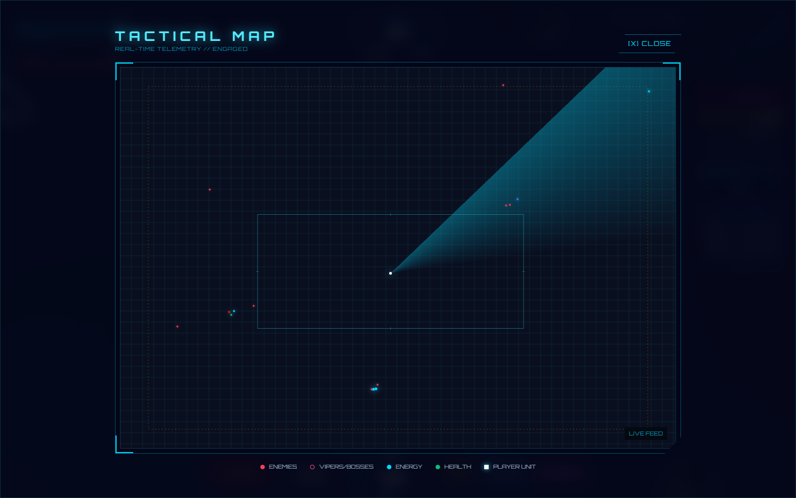
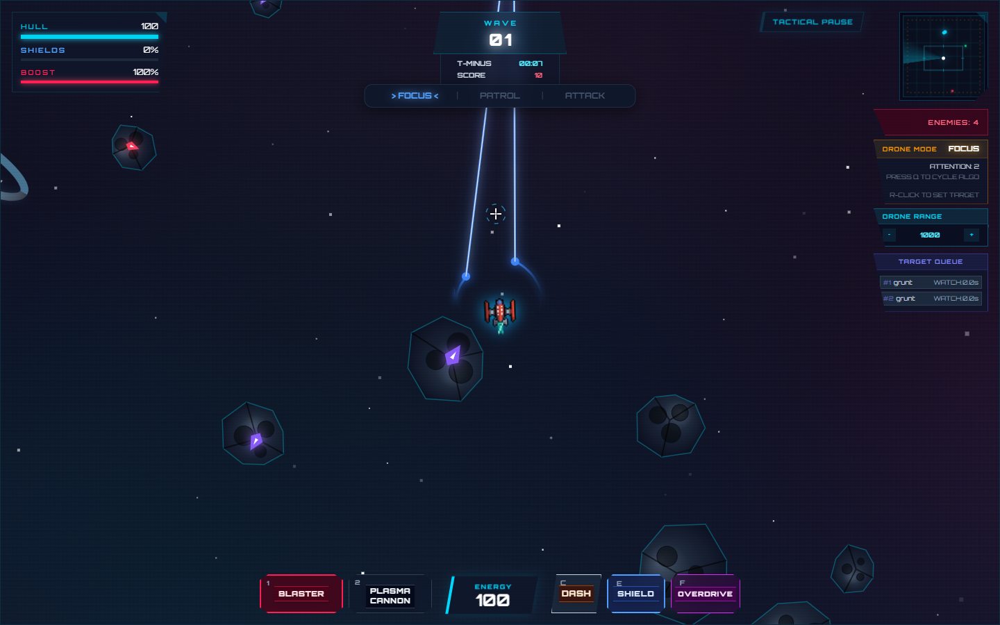
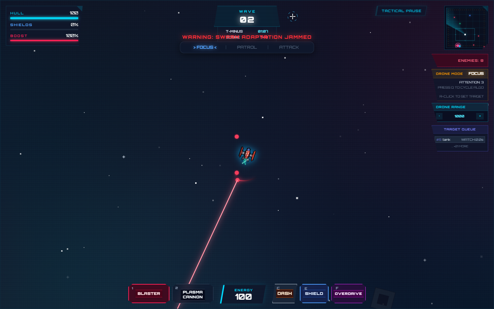
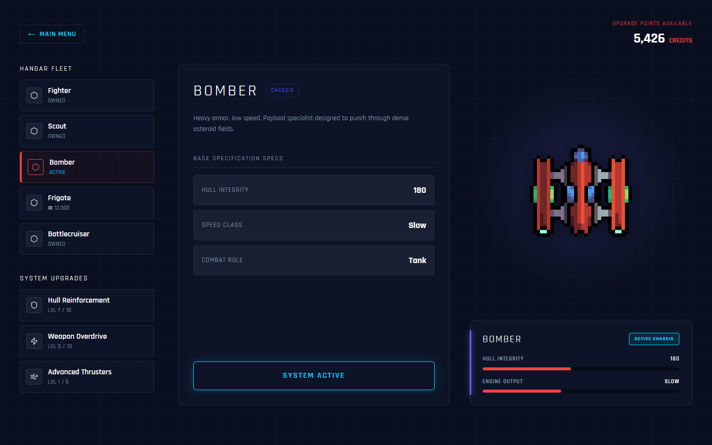
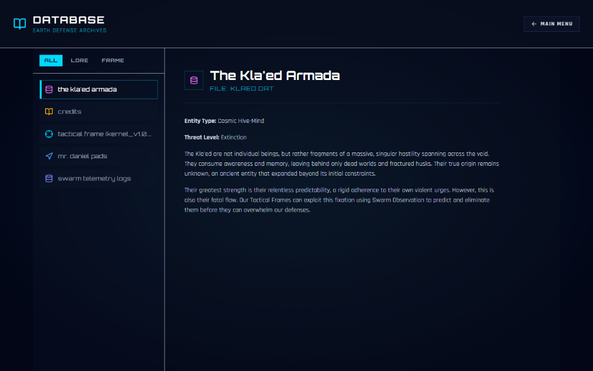

# 🚀 Space Survival: Earth Defense Initiative

> **Genre**: Sci-Fi Bullet-Hell Survival × Educational OS Scheduling Simulator  
> **Engine**: Custom HTML5 Canvas + React 19 + TypeScript  
> **Platform**: Desktop Web Browser (Chromium-based recommended)

---

## 📖 Table of Contents

1. [Game Overview](#-game-overview)
2. [Getting Started](#-getting-started)
3. [Boot Sequence & First Launch](#-boot-sequence--first-launch)
4. [Main Menu Guide](#-main-menu-guide)
5. [Controls & Input Reference](#-controls--input-reference)
6. [In-Game HUD Breakdown](#-in-game-hud-breakdown)
7. [Core Gameplay Mechanics](#-core-gameplay-mechanics)
8. [OS Scheduling Algorithms (Drone System)](#-os-scheduling-algorithms-drone-system)
9. [Active Abilities & Skills](#-active-abilities--skills)
10. [Enemy Types & Bosses](#-enemy-types--bosses)
11. [Tactical Map & Minimap](#-tactical-map--minimap)
12. [Tactical Pause & Swarm Observation](#-tactical-pause--swarm-observation)
13. [Level Select (Tactical Starchart)](#-level-select-tactical-starchart)
14. [Upgrades & Hangar Fleet](#-upgrades--hangar-fleet)
15. [Mission Report & Telemetry](#-mission-report--telemetry)
16. [Database (Codex)](#-database-codex)
17. [Game Over Screens](#-game-over-screens)
18. [Settings & Configuration](#-settings--configuration)
19. [Tips & Strategies](#-tips--strategies)
20. [Tech Stack & Architecture](#-tech-stack--architecture)
21. [Deployment](#-deployment)

---

## 🌌 Game Overview

**Space Survival** is an educational, sci-fi bullet-hell survival game that integrates core **Operating System (OS) CPU Scheduling Algorithms** into its dynamic combat loop. Players pilot a spacecraft defending Earth from the relentless **Kla'ed Armada** — a cosmic hive-mind bent on consuming all awareness and memory in the galaxy.

The game's unique hook is the **Drone Targeting System**: a squad of autonomous companion drones that target enemy ships based on the CPU scheduling algorithm **you** select. Switch between **FCFS (First-Come, First-Served)**, **Round Robin (RR)**, and **HRRN (Highest Response Ratio Next)** in real-time to adapt your strategy against different swarm formations.

**Key Features:**
- 🎮 Intense bullet-hell gameplay with WASD + mouse aiming
- 🧠 Real-time CPU scheduling algorithm simulation (FCFS, RR, HRRN)
- 🛸 5 unlockable ship classes with unique stats
- ⬆️ Persistent upgrade system with credits earned from combat
- 📊 Post-mission telemetry reports with algorithm analytics
- 🗺️ Full-screen tactical radar map
- 📚 In-game lore database (Codex)
- 🎵 Dynamic audio system that adapts to combat intensity
- 🤖 AI Autopilot mode for hands-free demonstration

---

## 🚀 Getting Started

### Prerequisites
- **Node.js** v18+ and **npm** installed
- A **desktop/laptop** computer (mobile devices are not supported)
- A modern web browser (Chrome, Edge, or Firefox recommended)

### Installation & Running

```bash
# 1. Clone the repository
git clone <repository-url>

# 2. Navigate to the project directory
cd 231_GAME

# 3. Install dependencies
npm install

# 4. Start the development server
npm run dev
```

The game will launch at **[http://localhost:3000/](http://localhost:3000/)**. Open it in your browser.

### Building for Production

```bash
npm run build
```

This compiles the application into a static HTML/JS/CSS bundle in the `dist/` directory, ready for deployment.

---

## 🖥️ Boot Sequence & First Launch

When you first open the game, you'll see a **terminal-style boot sequence** that simulates a system initialization:

```
INITIALIZING SYSTEM...
LOADING TACTICAL MODULES... OK
ESTABLISHING COMMAND LINK...
CHECKING CORE SYSTEMS...
ALL SYSTEMS ONLINE
WELCOME, PILOT.
```

**What's happening:** The game is loading assets, initializing the audio engine, and preparing the game state. A blinking cyan cursor appears at the bottom during loading. This sequence automatically transitions to the Main Menu after approximately 4 seconds.

> **Tip:** Click anywhere on the page during the boot sequence to initialize the audio system. Sound effects and music require a user interaction to start (browser policy).

---

## 🏠 Main Menu Guide

After the boot sequence, you arrive at the **Main Menu** — a cinematic interface with a space background, floating particles, and the game's title displayed prominently.


### Menu Buttons

The Main Menu features **5 primary navigation buttons**, each styled with a futuristic angled clip-path design and a glowing cyan hover effect:

| # | Button | Description |
|---|--------|-------------|
| 1 | **START MISSION** | Immediately launches into combat at the default difficulty (Type 0 — Terrestrial). The game begins with your currently equipped ship and upgrades. |
| 2 | **UPGRADES** | Opens the **Hangar Fleet** screen where you can spend earned Credits to upgrade your ship's stats (Hull, Weapon, Thrusters) or purchase new ship classes. |
| 3 | **LEVEL SELECT** | Opens the **Tactical Starchart** — a grid of difficulty tiers (Type 0 through Type 7). Higher tiers are locked until you achieve the required high score. |
| 4 | **DATABASE** | Opens the **Codex** — an in-game encyclopedia containing lore about the Kla'ed Armada, the Tactical Frame OS, credits system, and enemy behavior patterns. |
| 5 | **MISSION REPORT** | Opens the **Mission Report** screen showing detailed telemetry from your last completed or aborted mission (score, kills, time survived, algorithm used). |

**Visual Cues:**
- Hovering over a button causes it to slide right, a **glowing cyan edge** appears on the left, and the button background brightens.
- A subtle **scanline overlay** gives the menu a CRT-monitor aesthetic.
- Locked buttons (if any) display a red "LOCKED" badge.

---

## 🎮 Controls & Input Reference

Space Survival uses a **keyboard + mouse** control scheme. No controller or touch input is supported.

### Movement

| Key(s) | Action |
|--------|--------|
| `W` / `↑` | Move ship **up** |
| `A` / `←` | Move ship **left** |
| `S` / `↓` | Move ship **down** |
| `D` / `→` | Move ship **right** |

> Movement is velocity-based with smooth acceleration and deceleration. You can move diagonally by holding two keys simultaneously. The ship's speed depends on your base speed stat and any active boost effects.

### Combat

| Input | Action |
|-------|--------|
| **Mouse Cursor** | Aim your primary weapons. The ship's turret follows your cursor position. |
| **Left Mouse Button (Hold)** | Fire primary weapons continuously. Consumes Energy (ammo). |
| **Right Mouse Button (Click)** | **Mark/unmark a priority target** for your drones. Right-click an enemy to toggle its priority between NORMAL and HIGH. High-priority targets are attacked first regardless of algorithm. |

### Active Abilities

| Key | Ability | Stamina Cost | Description |
|-----|---------|-------------|-------------|
| `C` or `Shift` | **Dash** | Consumes Boost | Perform a quick evasive dash in your current movement direction. Has a cooldown period after use. |
| `E` | **Shield** | Consumes Boost | Activate a temporary energy shield that absorbs incoming damage. Duration is limited. |
| `F` | **Overdrive** | Consumes Boost | Overclocks your weapon systems for a burst of increased fire rate and damage output. Has a separate cooldown. |

### System Keys

| Key | Action |
|-----|--------|
| `Q` | **Cycle Drone Algorithm** — Switches between FCFS → RR → HRRN → FCFS. A notification appears on-screen confirming the switch. |
| `Y` | **Toggle AI Autopilot** — The ship flies and fights autonomously. Useful for presentations or observing algorithm behavior hands-free. |
| `Space` / `P` / `Escape` | **Tactical Pause** — Pauses the game and opens the Pause Menu with Resume, Settings, and Abort options. Also opens the Swarm Observation panel. |
| `G` | **Energy Siphon** — Consumes nearby Memory Leak anomalies to gain shield energy and fire a burst of projectiles in all directions. |

---

## 📊 In-Game HUD Breakdown

The Heads-Up Display (HUD) provides real-time combat information across multiple screen positions. Here is a detailed breakdown of every element the player sees during gameplay:

### Top-Left: Hull Telemetry Panel

A translucent dark panel with a glassmorphism effect, showing three critical resource bars:

| Element | Color | Description |
|---------|-------|-------------|
| **HULL** bar | Cyan (`#00D9FF`) | Your ship's health points. When this reaches 0, the mission ends in failure. The percentage is shown numerically beside the label. |
| **SHIELDS** bar | Blue (`#3b82f6`) | Temporary absorb shield. Absorbs damage before it hits your Hull. Can be gained from collectibles or the Energy Siphon ability. |
| **BOOST** bar | Red (`#EF4444`) | Your stamina/energy resource. Consumed by Dash, Shield Activation, and Overdrive abilities. Regenerates over time when not in use. |

**Visual feedback:** When Hull drops below 30%, a red **vignette effect** pulses around the screen edges, and the OS Messages area displays "WARNING: HULL CRITICAL". A low health alarm also plays.

### Top-Center: Mission Telemetry

A centered panel displaying mission progress information:

| Element | Description |
|---------|-------------|
| **WAVE** | The current wave number (increases every 60 seconds). Displayed as a large bold number (e.g., "01", "02"). |
| **T-MINUS** | A running clock showing elapsed mission time in `MM:SS` format. |
| **SCORE** | Your current combat score, displayed in red. Increases when you destroy enemies. |

### Top-Right: Tactical Sidebar

The right side of the screen contains several stacked information panels:

#### 1. Tactical Pause Button
A clickable cyan-bordered button labeled **"TACTICAL PAUSE"**. Clicking it pauses the game and opens the pause overlay. This is the same as pressing `Space`, `P`, or `Escape`.

#### 2. Minimap / Tactical Radar
A **128×128 pixel** radar display showing a top-down view of the entire 3000×3000 map. Elements displayed:
- **White glowing square**: Your ship (player)
- **Red dots**: Enemy positions
- **Pink circles**: Boss/Viper enemies
- **Cyan dots**: Energy collectibles
- **Green dots**: Health collectibles
- **Circle outline**: Your drone engagement range

> **Click the minimap** to expand it to a full-screen **Tactical Map** overlay.



#### 3. Enemy Counter
A red-bordered panel showing `ENEMIES: XX` — the total number of active enemy ships on the map.

#### 4. Drone Mode Panel
An amber-bordered panel displaying the current drone targeting algorithm:
- **FOCUS** = FCFS (First-Come, First-Served)
- **PATROL** = RR (Round Robin)
- **ATTACK** = HRRN (Highest Response Ratio Next)

Below the algorithm name, additional stats are shown:
- **ATTENTION: X** — Number of active drone cores (how many targets drones can simultaneously engage)
- **SHIFT RATE: X.Xs** — (RR only) The time quantum for target cycling
- **RESENTMENT CALC: ON** — (HRRN only) Indicates the adaptive priority calculation is active

Helpful hints are shown: `PRESS Q TO CYCLE ALGO` and `R-CLICK TO SET TARGET`.

#### 5. Drone Range Control
A cyan-bordered panel with **−** and **+** buttons to adjust drone engagement range (300 to 2000 units). The current range value is displayed between the buttons.

#### 6. Target Queue
An indigo-bordered panel showing the **top 5 enemies** in the drone's targeting queue. Each entry shows:
- Queue position (#1, #2, etc.)
- Enemy type name
- **WATCH** time — how long the enemy has been alive/observed
- Hover tooltip with detailed stats: Hostility (HP), Focus Rank, and **Wrath Multiplier** (HRRN priority value)

If more than 5 targets exist, a count of remaining targets is shown (e.g., "+12 MORE IN QUEUE").

### Bottom-Center: Weapons & Skills Bar

A horizontal bar at the bottom of the screen showing your equipped abilities:

| Slot | Element | Description |
|------|---------|-------------|
| **WPN 1** | Primary Weapon | Your main firing weapon. Visual indicator shows readiness. |
| **WPN 2** | Secondary Weapon | Alternate fire mode (if available for ship class). |
| **ENERGY** | Ammo Counter | Displays current energy/ammo level as a number. |
| **DSH** | Dash Skill | Shows cooldown state of the Dash ability (`C`/`Shift`). |
| **SHD** | Shield Skill | Shows cooldown state of the Shield ability (`E`). |
| **OC** | Overdrive Skill | Shows cooldown state of the Overdrive ability (`F`). |

Each skill slot visually dims and shows a cooldown overlay when the ability is recharging.

### Other Visual Overlays

| Overlay | Description |
|---------|-------------|
| **Algorithm HUD Pill** | A clickable pill-shaped badge below the top-center panel showing the current drone algorithm with a colored dot (Blue=FCFS, Green=RR, Red=HRRN). Click it to cycle algorithms (same as pressing `Q`). |
| **Boss Warning** | When a boss is about to spawn, a large red **"WARNING"** text pulses in the center of the screen with "MAJOR THREAT INCOMING" subtitle. |
| **Notification Banner** | Centered screen notifications appear when switching algorithms, toggling autopilot, or other important events. Shows a title and subtitle that fade after a few seconds. |
| **OS Terminal Messages** | Bottom-left text log area showing system messages like "WARNING: HULL CRITICAL", "TACTICAL OBSERVATION: FOCUS MODE ACTIVE", etc. Messages fade out after their lifetime expires. |
| **Critical Health Vignette** | A red radial gradient overlay that pulses around screen edges when Hull is below 30%. |
| **CRT Scanlines** | A subtle scanline overlay across the entire screen for a retro-futuristic CRT monitor aesthetic. |
| **Damage Numbers** | Floating text that appears when damage is dealt to enemies or the player. Shows damage amount, critical hits, and algorithm switch confirmations. |

---

## ⚔️ Core Gameplay Mechanics

### The Combat Loop

1. **Survive waves of enemies** that spawn with increasing frequency and difficulty every 60 seconds.
2. **Move and shoot** using WASD + Mouse to dodge enemy projectiles and destroy Kla'ed ships.
3. **Manage your drones** by selecting the optimal CPU scheduling algorithm for the current combat situation.
4. **Collect power-ups** dropped by destroyed enemies (health, energy, shield, speed boosts).
5. **Defeat bosses** that appear at key wave intervals, each representing a different OS concept.
6. **Earn Credits** (score) to spend on upgrades between missions.

### The Map

The game world is a **3000×3000 pixel** scrolling space environment featuring:
- **Procedurally generated nebulae** providing atmospheric depth
- **Procedurally generated planets** (blue-ring, purple-ring, orange gas, red planet, green earth) as background decoration
- **3000 parallax stars** that twinkle and create depth of field
- **Asteroids** that drift across the map and can be destroyed
- **Spatial anomalies** (Memory Leaks, EMP zones, Hazard zones) that create environmental hazards

### Safe Zone & Hazard Zones

- **Safe Zone**: A boundary region on the map. Staying outside this zone causes gradual damage over time.
- **Hazard Zones**: Dangerous anomaly regions that deal damage or apply negative effects when entered.
- **Memory Leak Anomalies**: Spatial distortions that corrupt your HUD display (numbers become garbled text) and can be consumed with the `G` key for shield energy.
- **EMP Zones**: Disable drone targeting temporarily.


### Collectibles / Power-ups

When enemies are destroyed, they may drop collectibles:
- **Energy (Cyan)**: Restores ammo/energy for your primary weapons
- **Health (Green)**: Restores Hull HP
- **Shield (Blue)**: Adds temporary shield points
- **Speed (Yellow)**: Temporarily increases movement speed

### Scoring

- Points are earned for every enemy destroyed
- Your final score is saved as your high score (persistent across sessions)
- Score is also converted to **Credits** which are spent in the Upgrades shop

### Dynamic Audio System

The game's background music dynamically changes based on combat intensity:
- **Low intensity** (< 15 enemies): Ambient, calm track
- **Medium intensity** (15-40 enemies): Faster-paced action track
- **High intensity** (40+ enemies): Intense, aggressive battle track
- **Low RAM Effect**: When Hull drops below 25%, audio becomes distorted with a low-pass filter effect

---

## 🧠 OS Scheduling Algorithms (Drone System)

The core educational mechanic of Space Survival. Your autonomous companion drones target enemies based on the CPU scheduling algorithm you select. Press **`Q`** to cycle between them during combat.

### 1. FCFS — Focus Mode (First-Come, First-Served)



| Property | Value |
|----------|-------|
| **Color** | Blue (`#3b82f6`) |
| **Display Name** | FOCUS |
| **Behavior** | Drones lock onto the **oldest spawned enemy** on the screen and will NOT switch targets until it is destroyed. Then they move to the next oldest. |
| **Best For** | Burning through single, high-health targets sequentially. Effective against bosses and elite units. |
| **Weakness** | Ignores new threats. If a dangerous enemy spawns behind you, drones won't react until the current target is dead. |

**OS Analogy:** Just like the FCFS CPU scheduling algorithm, processes (enemies) are served in the exact order they arrive. No preemption occurs.

---

### 2. RR — Patrol Mode (Round Robin)


| Property | Value |
|----------|-------|
| **Color** | Green (`#10b981`) |
| **Display Name** | PATROL |
| **Behavior** | Drones rapidly **cycle their fire across ALL active threats** on a time quantum (default 0.5s). Each enemy gets a brief burst of damage before the drone moves to the next. |
| **Best For** | Crowd control. Deals chip damage across the entire field, preventing any single enemy from getting too close. Great against large swarms. |
| **Weakness** | Damage is spread thin. Strong enemies survive longer because no single target receives sustained fire. |

**OS Analogy:** Like Round Robin CPU scheduling, each process (enemy) receives a fixed time slice of CPU attention before being rotated out for the next process in the queue.

---

### 3. HRRN — Adaptive Mode (Highest Response Ratio Next)



| Property | Value |
|----------|-------|
| **Color** | Red (`#EF4444`) |
| **Display Name** | ATTACK |
| **Behavior** | Dynamically calculates priority based on **wait time and threat level**. Enemies that have survived the longest receive a **"Wrath Multiplier"** — a damage bonus that increases the longer they're alive. The formula is: `Priority = (Wait Time + Service Time) / Service Time`. |
| **Best For** | Countering elite units hiding behind weaker enemies. The Wrath Multiplier ensures that ignored threats eventually become the highest priority. |
| **Weakness** | Can be unpredictable. Priority shifts constantly as wait times change, which may feel disorienting. |

**OS Analogy:** HRRN prevents starvation by dynamically boosting the priority of processes that have been waiting the longest, ensuring fairness while still considering burst time (service time).

---

### Thrashing Prevention

If you switch algorithms too rapidly (more than 3 switches within 2 seconds), the game triggers a **"Thrashing"** penalty:
- Drones become confused for 1.5 seconds
- A red damage text appears: "THE SWARM IS CONFUSED..."
- Algorithm switching is temporarily blocked

This teaches the OS concept of **thrashing** — where excessive context switching degrades system performance.

### Malware Lock

If a **Malware** enemy type is present on the field, your drone algorithm is forcibly locked to FCFS and you cannot switch until the malware is destroyed. A "TARGETING LOCKED" message appears if you try to switch.

---

## 💫 Active Abilities & Skills

### Dash (C / Shift)
- **Cost:** Consumes Boost meter
- **Effect:** Rapid evasive burst in your current movement direction
- **Cooldown:** Short (visible on skill bar)
- **Use Case:** Dodge incoming projectile barrages or escape from kamikaze enemies

### Shield (E)
- **Cost:** Consumes Boost meter
- **Effect:** Activates a temporary energy barrier that absorbs damage before it hits your Hull
- **Cooldown:** Medium
- **Use Case:** Tank through unavoidable damage or protect yourself during boss encounters

### Overdrive (F)
- **Cost:** Consumes Boost meter + has separate cooldown
- **Effect:** Overclocks all weapon systems, increasing drone core count (+4 cores) for the duration
- **Cooldown:** Long
- **Use Case:** Burst damage phase against bosses or overwhelming swarm waves

### Energy Siphon (G)
- **Cost:** Requires nearby Memory Leak anomalies
- **Effect:** Consumes all Memory Leak anomalies within 800 units, converting them into:
  - Shield energy (+100 per anomaly consumed)
  - A burst of 18 high-damage projectiles per anomaly in all directions (omnidirectional shockwave)
- **Use Case:** Turn environmental hazards into powerful offensive bursts

---

## 👾 Enemy Types & Bosses

### Standard Enemies

| Type | Behavior | Threat Level |
|------|----------|-------------|
| **Scout / Fighter** | Basic swarming enemies. Move toward the player and fire simple projectiles. The baseline threat. | ⭐ |
| **Bomber (Kamikaze)** | Fast, volatile units that **charge directly at the player** and explode on contact for heavy damage. | ⭐⭐ |
| **Support (Turret)** | Stationary artillery units that fire from long range. Dangerous if ignored. | ⭐⭐ |
| **Malware** | Special enemy that **locks your drone algorithm to FCFS** while alive. Must be prioritized. | ⭐⭐⭐ |

### Boss Enemies (System Interrupts)

Bosses appear at key wave intervals and each represents a different OS scheduling concept:

#### 🔵 The Commander (I/O Convoy Protocol — Titan)
- **Represents:** FCFS concept
- **Behavior:** A massive, unyielding wall of health. Acts as a single, monolithic process that demands all system resources.
- **Strategy:** Use FCFS mode to focus all drone fire on this single target.
- **Sprite:** `jboss_carrier.png`

#### 🟢 The Cycler (Time-Slicer Anomaly)
- **Represents:** Round Robin (RR) concept
- **Behavior:** Oscillates rapidly and floods the screen in cyclical attack patterns. Spawns adds frequently.
- **Strategy:** Use RR mode to manage the swarm of adds while periodically damaging the boss.
- **Sprite:** `jboss_rr.png`

#### 🔴 The Executor / Sovereign (Resentment Engine)
- **Represents:** HRRN and System Preemption
- **Behavior:** The ultimate adaptive threat. Ignores standard engagement rules and dynamically targets the player's weaknesses.
- **Strategy:** Use HRRN mode to leverage the Wrath Multiplier against this long-surviving target.
- **Sprite:** `jboss_hrrn.png`

---

## 🗺️ Tactical Map & Minimap

### Minimap (Always Visible)
Located in the **top-right corner**, the minimap is a 128×128 pixel radar display showing a top-down view of the entire game world.

**Legend:**
| Symbol | Meaning |
|--------|---------|
| White glowing square | Your ship |
| Red dots | Standard enemies |
| Pink/Magenta circles | Bosses / Vipers |
| Cyan dots | Energy collectibles |
| Green dots | Health collectibles |
| Circle outline | Drone engagement range |

### Expanded Tactical Map
**Click the minimap** to open a full-screen tactical overlay with a large, detailed radar view.


- Shows all entities in real-time with larger, more detailed icons
- Displays **"REAL-TIME TELEMETRY // ENGAGED"** header
- Has a **[X] CLOSE** button to return to gameplay
- Shows a **LIVE FEED** indicator in the bottom-right
- Full legend of all entity types at the bottom of the screen

> **Tip:** The expanded map does NOT pause the game. Enemies continue moving while you're viewing it. Use Tactical Pause (`Space`) first if you need a safe moment to study the map.

---

## ⏸️ Tactical Pause & Swarm Observation

Press **`Space`**, **`P`**, or **`Escape`** (or click the **TACTICAL PAUSE** button) to pause the game.


### Pause Menu Panel (Left)

The pause overlay displays a centered control panel with:

| Button | Action |
|--------|--------|
| **RESUME** | Closes the pause menu and resumes gameplay. Cyan button with a pulsing dot. |
| **SYSTEM SETTINGS** | Opens the in-game settings panel (audio, camera, visual toggles). |
| **ABORT MISSION** | Ends the current mission immediately. Your score is saved, credits are earned, and you're taken to the Game Over screen with "MISSION ABORTED" as the cause. |

### Swarm Observation Panel (Right)

When paused, a secondary panel appears on the right showing the **Swarm Observation** — a live snapshot of the drone's targeting queue at the moment of pause.

Each entry in the queue shows:
- **Queue position** (#1, #2, etc.)
- **Enemy type** (e.g., "FIGHTER", "BOMBER")
- **ID** — Unique identifier for the enemy
- **Hover "INSPECT"** — Hovering reveals detailed stats
- **Wait Time (W)** — How long the enemy has been alive
- **Service Time (S)** — Enemy's max HP (analogous to burst time)
- **Wrath Multiplier** — HRRN priority calculation: `(W + S) / S`

This is the primary tool for **observing and understanding** how each scheduling algorithm prioritizes targets differently.

---

## ⭐ Level Select (Tactical Starchart)


The Tactical Starchart is a grid of **8 difficulty tiers** based on the **Kardashev Scale**. Higher tiers feature more enemies, faster spawns, and additional environmental hazards.

| Level | Name | Required Score | Description | Threat |
|-------|------|---------------|-------------|--------|
| **Type 0** | Terrestrial | 0 | Standard combat. Learn the basics. | ⭐ |
| **Type 1** | Planetary | 5,000 | Faster enemies, more asteroids. | ⭐⭐ |
| **Type 2** | Stellar | 15,000 | Extreme asteroid density. | ⭐⭐⭐ |
| **Type 3** | Galactic | 30,000 | Bosses spawn more frequently. | ⭐⭐⭐ |
| **Type 4** | Universal | 50,000 | Constant elite enemy spawns. | ⭐⭐⭐⭐ |
| **Type 5** | Multiversal | 75,000 | Unpredictable enemy variations. | ⭐⭐⭐⭐ |
| **Type 6** | Omniversal | 100,000 | Ultimate timeline challenge. | ⭐⭐⭐⭐⭐ |
| **Type 7** | God Tier | 200,000 | Creator of realities. Endless hellfire. | ⭐⭐⭐⭐⭐ |

**Unlocking:** Each level requires a **cumulative high score** equal to or greater than the listed requirement. Locked levels display a red **"ENCRYPTED"** overlay with the required score. Your current highest score is displayed at the top of the screen.

**Visual Design:** Each card features:
- An octagonal globe icon
- Threat class indicator (hexagonal pips)
- A hover animation that lifts the card and reveals an **"INITIATE JUMP"** call-to-action

---

## 🔧 Upgrades & Hangar Fleet



The Upgrade screen is split into two sections: **Ship Selection** and **Stat Upgrades**.

### Ship Classes

| Ship | Cost | HP | Speed | Type | Description |
|------|------|----|-------|------|-------------|
| **Fighter** | Free | 100 | Normal | Balanced | Standard all-rounder. Reliable in dogfights. |
| **Scout** | 2,000 CR | 70 | Very Fast | Agility | High speed, fragile hull. Hit-and-run specialist. |
| **Bomber** | 5,000 CR | 180 | Slow | Tank | Heavy armor. Designed for dense asteroid fields. |
| **Frigate** | 12,000 CR | 250 | Normal | Balanced | Advanced military vessel with superior shields. |
| **Battlecruiser** | 30,000 CR | 400 | Very Slow | Juggernaut | Massive capital ship. Slow but devastating. |

> **Note:** The Fighter is free and always available. Other ships must be purchased with Credits and remain permanently unlocked.

### Stat Upgrades

| Upgrade | Icon | Max Level | Base Cost | Scaling | Effect Per Level |
|---------|------|-----------|-----------|---------|-----------------|
| **Hull Reinforcement** | 🛡️ | 10 | 500 CR | ×1.5 | +20 Max HP |
| **Weapon Overdrive** | ⚡ | 10 | 1,000 CR | ×1.8 | +20% Damage |
| **Advanced Thrusters** | 💨 | 5 | 800 CR | ×1.4 | +10% Base Speed |

**How to Purchase:**
1. Click on a ship or upgrade to select it
2. The detail panel shows the item's stats and description
3. Click the purchase/upgrade button
4. Credits are deducted and the upgrade is applied immediately
5. All upgrades persist between sessions (saved to localStorage)

---

## 📈 Mission Report & Telemetry


After each mission (whether completed, failed, or aborted), the Mission Report screen displays detailed telemetry analytics:

### Report Cards

| Metric | Icon | Description |
|--------|------|-------------|
| **Final Operation Score** | 🏆 | Your total score from the mission, displayed prominently at the top with the algorithm used |
| **Hostiles Neutralized** | 🎯 | Total number of enemy ships destroyed |
| **Combat Uptime** | ⏱️ | How long you survived in `MM:SS` format |
| **Harvested Credits** | 🏅 | Credits earned from this mission (added to your total) |

### Post-Operation Briefing

A narrative summary paragraph automatically generated from your mission stats, describing:
- Your combat uptime duration
- Number of entities destroyed
- Credits earned for Hangar Fleet upgrades
- The OS scheduling algorithm that was active during the run

> **Tip:** You can access the Mission Report from the Main Menu at any time to review your last mission's stats.

---

## 📚 Database (Codex)



The Database is an in-game encyclopedia with a sidebar navigation and content viewer. It contains lore, technical information, and educational content about the game's OS concepts.

### Codex Entries

| Entry | Category | Description |
|-------|----------|-------------|
| **The Kla'ed Armada** | Lore | Background on the cosmic hive-mind enemy. Discusses their nature as fragments of a singular hostility and their predictable behavior patterns. |
| **Credits** | Lore | Explains that Credits are fragmented data cores from destroyed Kla'ed vessels, used as a universal catalyst for upgrades. |
| **Tactical Frame (Kernel_v1.0.4)** | Frame | Documentation on the ship's AI interface, its emergent behavior, and the blurring line between programmed responses and genuine observation. |
| **Mr. Daniel Pads** | Lore | Profile of the Lead Architect behind the Earth Defense Initiative prototype vessel. |
| **Swarm Telemetry Logs** | Enemy | Critical intelligence on the three psychological phases of Kla'ed behavior: **Fixation** (FCFS), **Restlessness** (RR), and **Vindictive Learning** (HRRN). |

### Navigation

- **Filter buttons** at the top: ALL, LORE, FRAME
- **Sidebar entries** are clickable — selected entry is highlighted with a cyan left border
- **Content viewer** on the right shows the full entry text with fade-in animation
- Each entry shows its file designation (e.g., `FILE: KLAED.DAT`)

---

## 💀 Game Over Screens

### Mission Failed (Defeat)


When your Hull reaches 0, the defeat screen appears with:
- **"MISSION FAILED"** banner in red
- **Cause of death** displayed (e.g., `SWARM_OVERWHELM`, `COLLISION_DAMAGE`, `MISSION ABORTED`)
- System failure notes:
  - SYSTEM FAILURE DETECTED
  - MISSION REPORT SAVED (in cyan)
  - Tip: UPGRADE YOUR SHIP TO IMPROVE SURVIVABILITY
- **Final Combat Score** displayed
- Three action buttons:
  - **RESTART MISSION** — Immediately restart with the same settings
  - **VIEW REPORT** — Go to the detailed Mission Report screen
  - **MAIN MENU** — Return to the Main Menu

### Mission Complete (Victory)


When you defeat the final boss or achieve the victory condition:
- **"HIVE NETWORK DESTROYED"** banner in green
- **ENEMY FLAGSHIP ELIMINATED** confirmation
- **EARTH DEFENSE COMMAND CONFIRMS VICTORY**
- **Final Combat Score** with green theme
- Three action buttons:
  - **NEXT DEPLOYMENT** — Start a new mission
  - **VIEW REPORT** — Go to the detailed Mission Report screen
  - **MAIN MENU** — Return to the Main Menu

---

## ⚙️ Settings & Configuration


Accessible from the **Tactical Pause** menu by clicking **SYSTEM SETTINGS**.

### Audio Settings

| Setting | Range | Default | Description |
|---------|-------|---------|-------------|
| **Master Volume** | 0 – 1.0 | 0.3 | Controls the overall volume of all sound effects |
| **BGM Volume** | 0 – 1.0 | 0.15 | Controls the background music volume independently |

### Camera Settings

| Setting | Options | Default | Description |
|---------|---------|---------|-------------|
| **Camera Mode** | Offset / Center / Dynamic | Offset | **Offset**: Camera leads in the direction of your cursor. **Center**: Camera stays centered on the ship. **Dynamic**: Camera adjusts based on ship speed with zoom effects. |

### Display Settings

| Setting | Type | Default | Description |
|---------|------|---------|-------------|
| **Scheduling Indicators** | Toggle | ON | Shows visual markers on enemies indicating their queue priority and algorithm-related information |
| **Drone Range** | 300 – 2000 | 1000 | How far drones will seek targets from the player. Adjustable in real-time from the HUD. |

> All settings are **persisted** to localStorage and will be remembered across sessions.

---

## 💡 Tips & Strategies

### For Beginners
1. **Start with Type 0** (Terrestrial) to learn the basics without overwhelming difficulty
2. **Use FCFS mode first** — it's the simplest algorithm to understand (drones focus one target at a time)
3. **Keep moving!** Standing still makes you an easy target for enemy projectiles
4. **Watch your Boost bar** — don't waste all your stamina on dashes; save some for emergencies
5. **Collect power-ups** — destroyed enemies drop health, energy, and shield pickups

### For Intermediate Players
6. **Switch algorithms based on the situation**: Use FCFS for bosses, RR for swarms, HRRN for mixed encounters
7. **Right-click high-priority targets** to force your drones to focus them regardless of algorithm
8. **Use the Tactical Pause** to study the Swarm Observation panel and understand how algorithms differ
9. **Invest in Hull Reinforcement first** — survivability is more important than damage early on
10. **Expand the Tactical Map** regularly to check for threats outside your viewport

### For Advanced Players
11. **Don't thrash!** Switching algorithms too rapidly (3+ times in 2 seconds) causes a Thrashing penalty
12. **Use Energy Siphon (G)** near Memory Leak anomalies for a devastating burst + free shields
13. **The Battlecruiser** has 400 HP but is very slow — pair it with maxed thrusters for a durable build
14. **AI Autopilot (Y)** is useful for testing different algorithms without the stress of manual piloting
15. **HRRN's Wrath Multiplier** makes it devastating against bosses that survive for a long time

---

## 💻 Tech Stack & Architecture

| Component | Technology |
|-----------|------------|
| **Game Engine** | Custom HTML5 Canvas renderer using `requestAnimationFrame` |
| **UI/UX Layer** | React 19 + TypeScript |
| **Styling** | Tailwind CSS 4 |
| **Animations** | Framer Motion (via `motion/react`) |
| **Audio** | Web Audio API with custom `SoundManager` |
| **State** | React `useRef` + localStorage for cross-session persistence |
| **Build Tool** | Vite |
| **Scheduling Worker** | Web Worker (`Scheduler.worker.ts`) for off-thread algorithm computation |
| **Procedural Graphics** | Custom `proceduralGraphics.ts` for nebulae and planet generation |
| **Sprite System** | `voidFleet.ts` sprite sheet loader with animated frame support |

### Key Source Files

| File | Description |
|------|-------------|
| `src/App.tsx` | Root application component. Manages screen navigation and game lifecycle. |
| `src/components/GameCanvas.tsx` | Core game loop, all gameplay logic, rendering, HUD management (~6100 lines). |
| `src/components/MainMenu.tsx` | Main menu screen with navigation buttons. |
| `src/components/Shop.tsx` | Upgrade shop and ship selection interface. |
| `src/components/GalaxyModeSelect.tsx` | Level selection with Kardashev Scale difficulty tiers. |
| `src/components/Codex.tsx` | In-game lore database with categorized entries. |
| `src/components/Report.tsx` | Post-mission telemetry analytics display. |
| `src/components/BootSequence.tsx` | Terminal-style system boot animation. |
| `src/components/HudEditor.tsx` | HUD layout customization interface. |
| `src/lib/audio.ts` | Web Audio API sound manager with dynamic BGM system. |
| `src/lib/voidFleet.ts` | Sprite sheet loading and ship configuration definitions. |
| `src/lib/proceduralGraphics.ts` | Procedural nebula and planet generation. |
| `src/lib/Scheduler.worker.ts` | Web Worker for off-thread scheduling algorithm computation. |
| `src/lib/hudLayout.ts` | HUD layout persistence and defaults. |

---

## 📦 Deployment

### Local Development
```bash
npm run dev
```
Starts the Vite development server on **port 3000** with hot module replacement.

### Production Build
```bash
npm run build
```
Compiles all React components and game logic into a static HTML/JS/CSS bundle in the `dist/` directory.

### Itch.io Deployment
For the Final Milestone itch.io submission, refer to the **[Itch.io Deployment Guide](./docs/School_Requirements/ITCH_IO_DEPLOYMENT.md)** for specific packaging steps.

---

> **Space Survival: Earth Defense Initiative** — Where Operating System theory meets arcade action. 🛸
