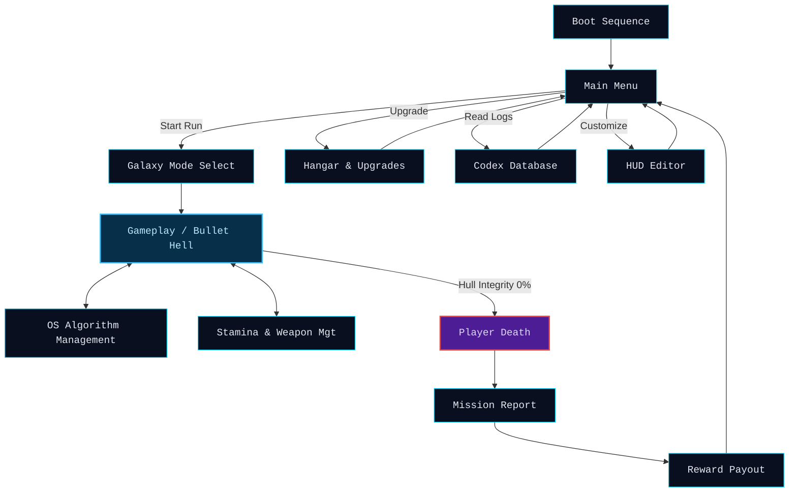

# PROGRESS REPORT #3

## User Interface and User Experience Design Documentation  
### User Perspective, Visual Design, and Interaction Development

**Course:** IT231 – Operating Systems  
**Program:** Bachelor of Science in Information Technology

**Members:**  
ALMARIO, MARK JUSTINE M.  
GERONIMO JR, EDDIE B.  
ONTE, JOHN PETER B.  
PIANO, MARK ANDRE C.  
TENDIDO, DANIEL MARK

**Date:** May 20, 2025

---

## Table of Contents
1. Introduction  
2. Game Information  
3. System Requirements  
4. User Interface (UI) Guide  
   4.1. Main Menu Interface  
   4.2. Gameplay Interface  
   4.3. Hangar and Upgrades Interface  
   4.4. Algorithm Integration Interface  
5. User Experience (UX) Flow  
   5.1. General UX Flow  
   5.2. Sample UX Flow Explanation  
   5.3. UX Flow with Algorithm Application  
6. Installation Guide  
7. Audio and Visual Design  
8. Future Updates and Expansion Plans  
9. References

---

## 1. Introduction

Welcome to **Space Survival**, an endless, top-down bullet-hell roguelite that doesn't just play like a game—it operates like a computer. Players pilot an advanced fighter craft across deep space, battling relentless cybernetic alien swarms. The game gamifies Operating Systems CPU scheduling concepts (FCFS, RR, HRRN) in real-time combat scenarios while offering extensive HUD customization and persistent upgrades to restore order to a corrupted sector.

---

## 2. Game Information

- **Title:** Space Survival
- **Genre:** Sci-Fi / Endless Bullet-Hell / Roguelite
- **Target Platform:** Web Browser (Desktop optimized)
- **Target Audience:** Fans of action-packed, fast-paced arcade shooters and computer science students.
- **Game Engine / Tech Stack:** React 19, TypeScript, Vite, HTML5 Canvas API, Tailwind CSS 4, Framer Motion.

---

## 3. System Requirements

**Minimum System Requirements:**
- **OS:** Windows 10 / macOS 10.14 / Linux
- **CPU:** Dual-Core 2.0 GHz or higher
- **RAM:** 4 GB RAM
- **GPU:** WebGL compatible browser with Hardware Acceleration enabled
- **Storage:** Minimal (Web-based application)
- **Browser:** Google Chrome, Mozilla Firefox, Microsoft Edge, Safari (latest versions)

---

## 4. User Interface (UI) Guide

The User Interface (UI) of **Space Survival** is designed to provide high readability during chaotic bullet-hell sequences, seamless immersion with animated UI elements, and the display of necessary tactical information (like stamina and ability cooldowns) without obstructing gameplay.

### 4.1. Main Menu Interface

The main menu is the first screen displayed when the game starts, featuring a cybernetic boot sequence followed by access to the major game modes.

**Main Menu UI Elements**

| UI Element    | Description                                                                   |
|--------------|-------------------------------------------------------------------------------|
| Start Game   | Launches the player into the combat zone.                                     |
| Hangar       | Access to the ship engineering bay for upgrades.                              |
| Settings     | Lets the player adjust HUD layout (HUD Diagnostics) and volume.               |
| Codex        | Displays lore, enemy database, and mission reports.                           |

**Figure 1.** Main menu interface for *Space Survival*.

---

### 4.2. Gameplay Interface

The gameplay HUD is designed as a glassmorphic terminal. It combines Deep Space Blue (#0A0F1F) with Neon Cyan (#00D9FF) and Radar Red (#EF4444) to direct player focus.

**Gameplay UI Elements**

| UI Element         | Description                                                                                     |
|--------------------|-------------------------------------------------------------------------------------------------|
| Health / Hull Bar  | Displays the remaining integrity of the player's ship (Red).                                    |
| Boost / Stamina Bar| Shows energy available for dashing and evasive maneuvers.                                       |
| Weapons & Skills   | Dynamic cooldown tracking for Kinetic Blaster, Plasma Cannon, Dash, Shield, and Overdrive.      |
| Score & Wave       | Displays current accumulated points and the ongoing wave level.                                 |
| OS Algorithm Panel | Indicates the currently active companion drone AI targeting strategy (FCFS, RR, HRRN).          |

**Figure 2.** Space Survival HUD showing weapon active states, stamina, and the OS Scheduler layout.

---

### 4.3. Hangar and Upgrades Interface

The Hangar interface allows the player to use collected credits to purchase persistent upgrades and improve ship combat capabilities.

**Hangar UI Elements**

| UI Element           | Description                                                                  |
|----------------------|------------------------------------------------------------------------------|
| Upgrade Nodes        | Selectable improvements like Max Health, Base Damage, Fire Rate, etc.        |
| Credits Display      | Shows the total amount of currency available.                                |
| Item Description Box | Provides the exact stat boost an upgrade will provide.                       |
| Enhance Button       | Spends credits to lock in the upgrade.                                       |

**Figure 3.** Hangar engineering bay interface.

---

### 4.4. Algorithm Integration Interface

The algorithm interface shows how the assigned Operating System algorithms are applied dynamically to companion drone targeting systems and boss behaviors in gameplay.

**OS Algorithm Integration**

| Algorithm                | UI / Gameplay Application                                                                                 |
|--------------------------|-----------------------------------------------------------------------------------------------------------|
| First-Come, First-Served (FCFS) | Drone systems lock onto the first enemy that spawns and will not switch targets until it is destroyed. The "Executor" boss also enforces this strictly. |
| Round Robin (RR)         | Drones cycle their focus across all available targets for an equal "time quantum" before switching. The "Cycler" boss uses repeating cyclical attack patterns. |
| Highest Response Ratio Next (HRRN)| Drones calculate target priority using `(Wait Time + Service Time) / Service Time` to shift attack priorities dynamically. Utilized by the Hive Overlord. |

---

## 5. User Experience (UX) Flow

The User Experience (UX) Flow outlines the player's journey from launch through active gameplay loops and failure states.

### 5.1. General UX Flow

1. **Launch:** Boot sequence -> Splash Screen -> Main Menu.
2. **Preparation:** Navigate to Hangar for upgrades or Database for lore.
3. **Gameplay:** Start run -> UI slides in -> Wave progression & bullet-hell combat.
4. **Action & Management:** Switch weapons, manage stamina, rotate OS algorithms on drones.
5. **Aftermath:** Player death -> Mission Report -> Reward payout (Credits) -> Return to Hangar/Menu.

**Figure 4.** General UX flow of the player journey.

### 5.2. Sample UX Flow Explanation

When the player opens **Space Survival**, the retro terminal boot sequence is displayed. The player may:
- Dive straight into combat.
- Visit the Hangar to spend previously earned credits.
- Adjust their UI dynamically using the HUD Editor.

After launching, the HUD overlays cleanly on top of the HTML5 Canvas action. Players experience wave progression and must actively balance dodging bullets with tracking incoming threats. The screen edge flashes red when health is critical, and visual pop-ups display damage numbers or "+SHIELD" cues when power-ups are grabbed. Upon destruction, the "MISSION REPORT" displays stats, logging the "Process" (enemy) that caused system failure, and converts the score into spendable Credits.

### 5.3. UX Flow with OS Algorithm Application

**Figure 5.** Algorithm UX flow showcasing dynamic targeting.

**Sample Scenario:**  
A massive swarm of varied enemies spawns, including high-health turrets and low-health drones. The player acts:
- Presses `Q` to switch the Drone System to **Round Robin (RR)** to deal splash damage across the entire swarm.
- When a heavy Boss spawns, the player switches the algorithm to **First-Come, First-Served (FCFS)** or **Focus Mode**, directing all drone fire entirely onto the boss.
- If the screen is overwhelmed by varied enemies with different threat levels, the player switches to **Highest Response Ratio Next (HRRN)**. The drones dynamically prioritize targets based on how long they have been alive (Wait Time) versus their health pool (Service Time).
- **HRRN UX Feedback:** The UI specifically highlights enemies with the highest `(Wait Time + Service Time) / Service Time` ratio using a glowing magenta vector line. The drone breaks off from its current target and dynamically seeks out these high-priority, long-surviving targets. This applies a "Wrath Multiplier" damage bonus, efficiently cleaning up the screen.
- This creates an interactive puzzle of threat management via OS scheduling theory.

---

## 6. Installation Guide

1. Ensure you have a modern web browser installed (Google Chrome, Firefox, or Edge).
2. Navigate to the game's deployed URL (or run locally using `npm run dev` after installing dependencies via `npm install`).
3. The game will load directly within the browser window.
4. No external downloads, plugins, or installations are required.

---

## 7. Audio and Visual Design

- **Visual Theme:** Deep Space Sci-Fi cyberpunk. Heavy use of terminal-green/cyan glows, glassmorphism UI overlays, octagonal layouts, and high-contrast particle effects over a starfield canvas.
- **Color Scheme:** Deep Space Blue (`#0A0F1F`) background, Neon Cyan (`#00D9FF`) for player feedback, and Radar Red (`#EF4444`) for enemy projectiles/alerts.
- **Audio Design:** Utilizing a custom Web Audio API synthesizer engine that plays procedural kick drums, sci-fi arpeggios, and glitching alert sounds depending on the combat state, mimicking a retro-futuristic arcade environment.

---

## 8. Future Updates and Expansion Plans

- **Leaderboards:** Introduction of a global high-score database.
- **New Scheduling Algorithms:** Adding Multi-level Queue or Shortest Job First (SJF) into the drone behavior options.
- **New Enemies:** Expanding the Hive Network's roster with stealth/ambush units.
- **Touch Controls:** Adding full mobile/tablet support with a virtual joystick overlay.

---

## 9. References

- Silberschatz, A., Galvin, P. B., & Gagne, G. (2018). *Operating System Concepts* (10th ed.). Wiley.
- MDN Web Docs. (2024). *Canvas API*. Retrieved from https://developer.mozilla.org/en-US/docs/Web/API/Canvas_API
- React Documentation. (2024). Retrieved from https://react.dev/
