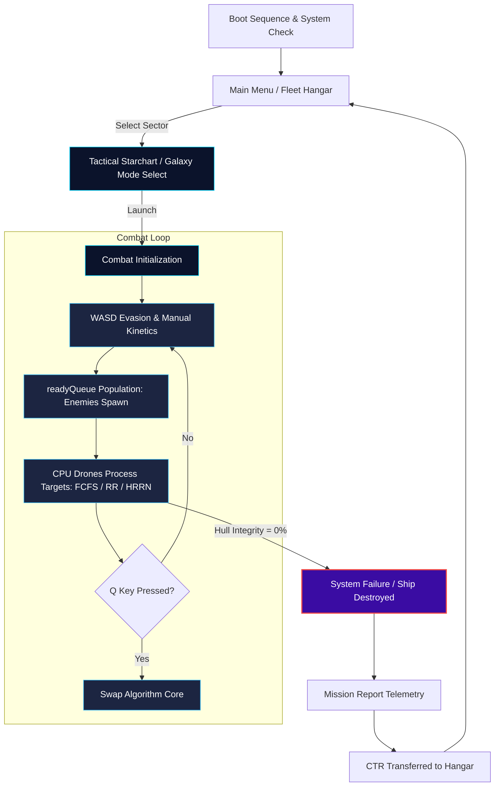

# PROGRESS REPORT #2 - GAME PLAY
## Detailed Game Mechanics, System Behavior, and OS Integration

**Course:** IT231 - OPERATING SYSTEMS  
**Program:** BACHELOR OF SCIENCE IN INFORMATION TECHNOLOGY  
**Date:** MAY 8, 2025  

**Team Members:**
* ALMARIO, MARK JUSTINE M.
* GERONIMO JR, EDDIE B.
* ONTE, JOHN PETER B.
* PIANO, MARK ANDRE C.
* TENDIDO, DANIEL MARK

---

# Project: Space Survival

## A. How to Play

### Mechanics
In **Space Survival**, the player pilots an advanced experimental spacecraft using either a mouse-and-keyboard setup (desktop) or virtual joysticks (mobile). The primary objective is to maneuver through deep space, evade incoming projectiles, manage stamina, and utilize a range of weapons and abilities to eliminate hostile alien forces.

**Core Mechanics:**
* Navigate a hostile space environment filled with enemies and environmental hazards.
* Continuously manage positioning, stamina, and timing of abilities to survive escalating waves.
* Destroy enemies to gain Credits (CTR), which can be used for permanent upgrades.

### Controls

**Desktop Controls:**
* **Movement:** W / A / S / D or Arrow Keys – Move the spacecraft up, left, down, and right.
* **Aim / Fire:** Mouse Cursor – Aim weapons towards the crosshair; hold click to fire in this direction.
* **Primary Fire (KINETIC):** Rapid-firing continuous shot towards the current aim direction.
* **Secondary Fire (PLASMA):** Fires a wide spread-shot of plasma projectiles, ideal for crowd control against multiple targets.
* **Swap Weapon:** X (or 1/2) – Toggles between KINETIC and PLASMA weapon modes.
* **Shield (SHD):** E – Deploys a temporary energy barrier that absorbs all incoming damage while stamina persists.
* **Dash:** C – Consumes stamina to execute a rapid evasive burst in the current movement direction.
* **Overdrive:** F – Overclocks weapons for maximum damage and fire rate, draining shields and stamina.
* **Pause:** Esc or P – Suspends gameplay and opens the tactical pause menu.

**Mobile Controls:**
* **Movement:** Left Virtual Joystick – Controls the ship’s directional movement.
* **Aim / Fire:** Right Virtual Joystick – Controls the aiming direction and primary fire.
* **Abilities:** On-screen buttons for changing weapons, Shield, Dash, Overdrive, and Pause mapped similarly to desktop actions.

*Controls are designed to be intuitive and responsive for beginners, while providing enough depth for advanced players who want to master movement, dodging, and ability timing.*

### Environmental Hazards
The player must also navigate various environmental threats that increase the difficulty:
* **Asteroid Fields:** Large floating rocks that block shots and obstruct line of fire. They demand careful maneuvering through dense belts to avoid being trapped or to use them as natural shields against alien fire.
* **Toroidal Space (Wrap-around):** The battlefield is an infinite looping arena. Flying off one edge of the sector instantly wraps the ship to the opposite edge (similar to classic arcade games). This can be used for rapid repositioning, but enemies and projectiles can also wrap around, creating unexpected crossfire scenarios.

---

## B. Win / Lose / Retry Conditions

### 1. How to Win
**Space Survival** is designed as an endless survival-and-progression experience rather than a traditional single-stage win condition. The player’s concept of “winning” is defined by:
* Surviving increasingly difficult enemy waves.
* Defeating massive boss encounters that appear at key intervals.
* Accumulating high scores that unlock higher Kardashev Scale “Galaxy Modes” (up to God Tier).
* Earning Credits (CTR) each run and investing them into permanent upgrades in the Fleet Hangar (e.g., hull, speed, damage, new ships).

The long-term goal is to push as far as possible into higher-tier modes and maximize both score and progression.

### 2. How to Lose
A run ends when the player’s ship reaches 0 HP (Hull Integrity). Damage can be taken in multiple ways:
* Being hit by enemy projectiles.
* Colliding with asteroids or other solid obstacles.
* Getting rammed by alien vessels.
* Remaining outside the Safe Zone boundary for an extended time, taking continuous radiation damage.

Once Hull Integrity is fully depleted, the current attempt is considered failed, and the Game Over sequence is triggered.

### 3. How to Try Again
When the ship is destroyed, a “SHIP DESTROYED” transmission modal appears on screen. From here, the player can:
* Press **“Launch Again”** to immediately restart a new run beginning at Wave 1, using the currently equipped ship and loadout. This allows for quick re-entry into the game loop, encouraging repeated attempts and score-chasing.

### 4. How to Restart
If the player wishes to adjust their setup or change the game mode, they have additional options. 
* From the Game Over screen, select **“Main Menu”** to change loadout or weapons, upgrade ships in the Fleet Hangar using accumulated Credits, or select/unlock different Galaxy Modes based on previous high scores.
* During an active run, the player can open the **Pause Menu** and choose **“Abort Mission”** to end the current run early and return to the main menu to reconfigure settings, upgrades, and modes.

---

## C. Power-ups, Rewards, and Points

A mix of in-run power-ups and meta-progression rewards drives progression and replayability:
* **Credits (CTR):** The primary in-game currency earned by destroying enemies, surviving waves, and defeating bosses. Spent in the Armory / Hangar to permanently upgrade ships (HP, speed, damage) and unlock new vessels.
* **High Score:** Tracks the player’s best performance per run. Higher scores unlock new Galaxy Modes along the Kardashev scale. Elite enemies and bosses yield large score bonuses.
* **Health Kits (+):** Green squares that restore a portion of the ship’s Hull Integrity.
* **Shield Batteries:** Blue circles that restore the ship's energy shield, protecting hull integrity.
* **Stamina Cells:** Purple items that refill the stamina gauge used for dodging and sprinting.
* **Ammo Packs:** Amber items that replenish ammunition reserves for primary and secondary weapons.
* **Speed Boosts (>>):** Yellow temporary power-ups that overload the ship’s thrusters for a short burst of high speed.
* **Weapon Overdrives (W):** Red offensive power-ups that temporarily supercharge the ship’s cannons, greatly increasing rate of fire and damage.
* **Combat Drones:** Deployable automated support units that orbit around the player’s ship, provide additional covering fire against nearby targets, and help clear weaker enemies and relieve pressure during intense phases.

---

## D. Story Mode

Humanity is on the brink of extinction. A colossal alien armada, led by a massive flagship, is advancing toward Earth with the intent to conquer and eradicate. In response, the nations of Earth unite under a single goal: survival.

A visionary leader, **Mr. Daniel Pads**, proposes a radical defense initiative—a new class of experimental spacecraft capable of intercepting the enemy fleet before it reaches the planet. You are the pilot chosen to command this prototype vessel.

**Your mission is clear:**
* Intercept the Kla’ed armada in deep space.
* Prevent their forces from breaching Earth’s atmosphere.
* Use every weapon, upgrade, and maneuver at your disposal to hold the line.

The fate of humanity rests on your performance in every run. Each battle, each wave, and each victory pushes the alien invasion one step closer to failure—or Earth one step closer to annihilation.

---

## E. CPU Scheduling Algorithms Integration (Core OS Integration)

To satisfy the academic objectives of the IT231 course, **Space Survival** gamifies real-world **CPU Scheduling Algorithms** by mapping them directly onto the player's **orbital target-defense drones**. Drones act as CPU Cores, and active enemies represent Process Threads waiting in the Ready Queue (`readyQueue`).

The player can hot-swap the active scheduling algorithm in real-time using the `Q` key. This dynamically alters how drone cores select and process their targets:

### 1. First-Come, First-Served (FCFS)
* **Logic:** The oldest process (the enemy that has been present on the battlefield the longest) is targeted first. The drone locks onto this target and fires homing lasers until the enemy is fully destroyed (completed), regardless of threat level or proximity.
* **Academic Visualization:** This demonstrates the **Convoy Effect**. If a high-HP "Tank" enemy enters the arena first, the drones become fully occupied processing it, letting fast, dangerous "Kamikaze" enemies swarm the player unchecked.
* **HUD Telemetry:** Displays the targeted enemy at the head of the CPU queue buffer.

### 2. Round Robin (RR)
* **Logic:** The CPU drone targets each enemy in the queue for a fixed **Time Quantum** (approx. 0.5 seconds). Once the quantum expires, the current target is pre-empted and moved to the back of the queue, and the drone switches to the next enemy in sequence.
* **Academic Visualization:** Demonstrates **time-sliced scheduling**. It spreads damage evenly across all active targets, suppressing large swarms but taking longer to completely eliminate individual high-HP threats.
* **HUD Telemetry:** The drone lock-on vector lines rapidly cycle between enemies on screen.

### 3. Highest Response Ratio Next (HRRN)
* **Logic:** The CPU drone calculates the priority of all enemies in range using the **Response Ratio (RR)** formula:
  $$Response\ Ratio = \frac{W + S}{S}$$
  * **$W$ (Waiting Time):** The duration the enemy has been alive on the battlefield.
  * **$S$ (Service Time / Burst Time):** The current HP of the enemy (representing required processing cycles).
* **Academic Visualization:** Demonstrates **non-preemptive dynamic priority scheduling**. By dividing by $S$, low-HP targets (shorter jobs) are prioritized to prevent clutter, while the accumulation of $W$ (Aging) ensures that even high-HP targets are eventually prioritized so they do not suffer from starvation.
* **HUD Telemetry:** High response-ratio enemies are marked with flashing priority indicators.

---

## F. Boss Mechanics & Algorithmic Counterplays

The game features massive bosses specifically themed around CPU scheduling concepts:

### 1. The Cycler (Round Robin Dreadnought)
* **Behavior:** Deploys a "Time-Slice Barrage". It rotates and fires a continuous spiral of bullets, periodically pausing to fire 360-degree laser rings and launch waves of Kamikazes in a cyclical rotation.
* **Strategy:** Players must match their movements to the "time quantum" gaps in its laser spirals.

### 2. The Executor (HRRN Mothership)
* **Behavior:** Incorporates an **Aging Priority** mechanic. The longer the Executor remains in the arena (Wait Time $W$ increases), its internal priority level rises, exponentially amplifying its rate of fire and the visual scale/damage of its homing energy lasers.
* **Strategy:** Players must engage in a high-DPS race, using upgraded weaponry to terminate the boss before its priority level maxes out.

---

## G. Simulation & Testing: AI Autopilot Mode

To provide testing evidence and demonstrate system functionality hands-free, the game features a built-in **AI Autopilot / Tester Mode** (toggled via the `Y` key):

* **Collision Evasion:** Calculates vector fields representing repulsive forces around active bullets, asteroids, and boundaries, steering the ship dynamically to dodge hazards.
* **Target Routing:** Steers the ship to maintain optimal range based on target class (e.g., maintaining safe distance from Bosses while closing in on Grunts).
* **Loot Collection:** Prioritizes collecting Health Kits if HP falls below 50%, and collects Credit drops to optimize resource gain.
* **OS Automation:** Automatically engages special abilities (Dash when bullets are extremely close, Shield when HP drops below 60%) to stress-test game stability over prolonged runs.

---

## H. Relativistic Physics: Safe Zone & Singularities

To enrich gameplay mechanics, the game incorporates spatial and physics systems:

* **Safe Zone Grid:** The player operates within a coordinate grid. Traversing outside the boundary triggers an emergency alarm, and the hull takes continuous damage until returning to the safe zone.
* **Supermassive Black Holes:** Gravity wells that spawn based on score milestones. They apply Newtonian gravitational force, pulling the player, enemies, debris, and projectiles toward their core. 
* **Time Dilation & Spaghettification:** As objects approach the event horizon, their velocity propagation vectors decay (simulating time dilation). Crossing the event horizon triggers instant destruction or rapid hull decay.

---

## I. System Process Flowchart

Below is a schematic flowchart of the gameplay process and state loop:

